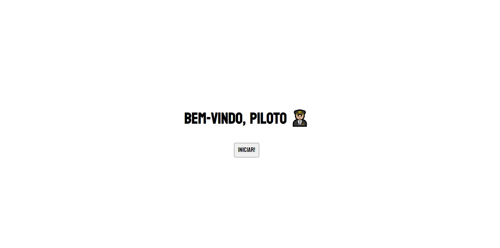

# Delta station 👨🏼‍✈️

This project was made to test my skills in Typescript. All of this code, from the initial idea to the execution of it, was made by me.

## Table of contents

- [Overview](#overview)
  - [The project](#the-project-)
  - [Screenshot](#screenshot-)
  - [Links](#links-)
- [My process](#my-process-)
  - [Built with](#built-with-)
  - [What I learned](#what-i-learned-)
  - [Continued development](#continued-development-)
  - [Useful resources](#useful-resources-)
- [Author](#author-%EF%B8%8F)
- [Acknowledgments](#acknowledgments-)

## Overview

### The project 🚀

You are a spaceship pilot who is looking for a new mission. To do this, you go to the delta station to speak with the general commander.
This minigame was conceived in the mechanics of the RPG game created in 2015, Undertale. That is, there is interactivity in the player's responses that lead to the different responses from the game in a dynamic way.

> All the spaceships data is persistent. It means all information about them is saved, like if it is on a mission, who its crew is, etc until the user reloads the page.

### Screenshot 📷

## My process 

### Built with ⚙

- Semantic HTML5 markup
- Typescript
- Flexbox
- [React](https://reactjs.org/) - JS library

### What I learned 📚
 
#### JavaScript
- Creating a modal with pure javascript
- Creating a custom adjust price with javascript function

### Continued development 🎯

- Refine my knowledge of Javascript types and master Typescript

## Author 🙎🏻‍♂️

- Website - [Alberto Albuquerque](https://portfolio-allbertuu.vercel.app/)
- Frontend Mentor - [@allbertuu](https://www.frontendmentor.io/profile/allbertuu)
- LinkedIn - [Alberto Albuquerque](https://www.linkedin.com/in/albertov-albuquerque/)

[Back to the 🔝](#delta-station-)
